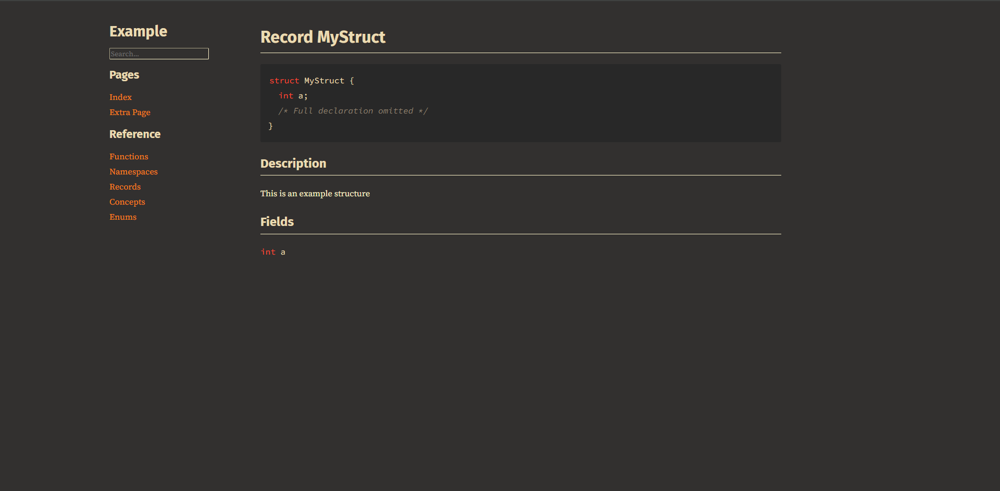

# cppdoc 
cppdoc is a C++ documentation generator inspired by `rustdoc`

## Features
- `rustdoc`-like documentation comments, rendered using markdown
- Documentation tests using codeblocks
- Extra pages written in markdown
- [Mermaid](https://mermaid.js.org) graphs
- Flexible styling options with user-supplied stylesheets (see default themes in `example/`)
- libclang-based parser with support for records, enums, functions and namespaces
- Decent performance, with generation usually being faster than libclang-backed Doxygen

## Usage
See [USAGE.md](USAGE.md)

## Preview
There is a live demo available [here](https://rdmsr.github.io/cppdoc).

Here is what cppdoc looks like with three different stylesheets:

`example/static/light.css`:

`example/static/ayu.css`:

`example/static/gruvbox.css`:

